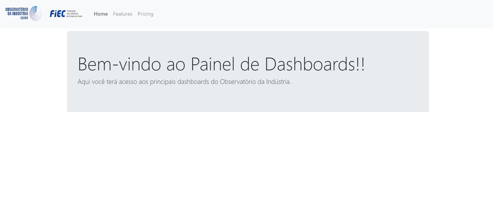

# Flask Web App - Dash Plotly

Este projeto Flask está sendo desenvolvido para a integração do Flask Web App com o Dash Plotly para criação de uma aplicação para análise de dados com Dashboads utilizando o Dash e Plotly


## Como utilizar o projeto:
1 - Clone o projeto: git clone https://github.com/sanchesfranklin/flask_dashboard_dash.git

2 - Inicie um ambiente virtual dentro do diretório do projeto com os comandos:

```~bash
# Iniciando o ambiente virtual
python -m venv .venv - .\.venv\Scripts\activate

# Instalando os pacotes necessários
pip install -r requirements.txt
```

Este projeto utiliza o Pylint para padronizar o código python, afim de seguirmos as melhores práticas de codificação.

Até o momento nossa página está dessa forma:


